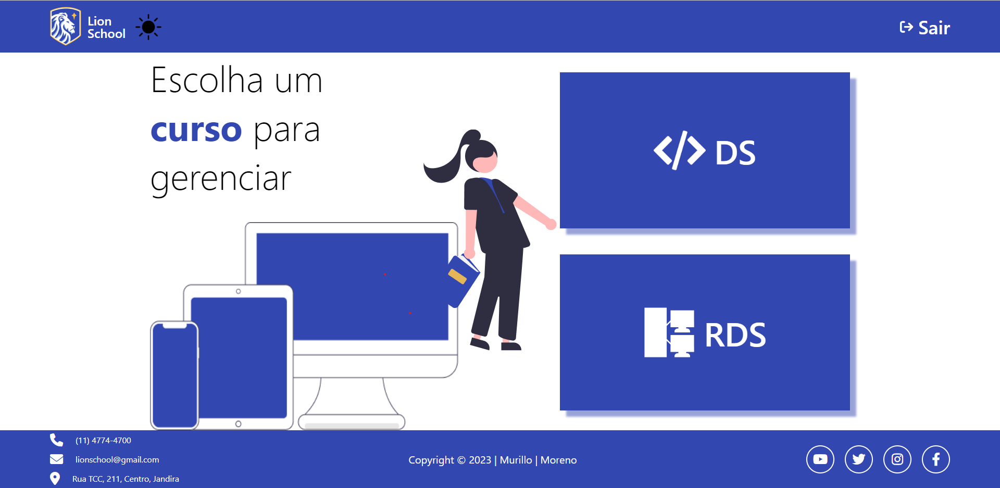

# lion-school

|        DESKTOP      |
|:-------------------:|
||
|                     |              

[Clique aqui](https://murillobarbosa.github.io/lion-school-front/) para acessar o site!

## **Sobre** 
A atividade tem como objetivo integrar as disciplinas de PWFE (Programação web Front-end) e PWBE (Programação web Back-end) do curso de desenvolvimento de sistemas do SENAI Jandira.

O projeto é o gerenciamento da escola Lion School, deverá ser realizado tanto o back-end como o front-end.

---
## **Tecnologias utilizadas**
- HTML
- CSS
- JavaScript
- Markdown
- Responsividade

---
## **Relatório LightHouse**

O Lighthouse é uma ferramenta automatizada que aprimora a qualidade dos apps da Web, simulando diversas situações que podem afetar a experiência do usuário. Relatório abaixo:

---
##  **Ferramentas**
- [link do Figma](https://www.figma.com/file/MsVYmrEaNCZYKawF9Ns6vH/lion_school_front?t=1bt12spHB4S9c8WP-0)
- GitHub
- Font Awesome
- Visual Studio Code

---
## **Critérios**
- [x] Criou layout conforme designer feito no Figma?
- [x] Os botões dos cursos são dinâmicos?
- [x] Os cards são criados dinamicamente?
- [x] A página com informações dos cursos foi criada dinamicamente?
- [x] O filtro por status está funcional?
- [x] Os nomes das variáveis, funções e arquivos tem valor semântico?
- [x] A maioria das funções seguem as boas práticas como responsabilidade única?
- [x] Foi criado o layout responsivo no Figma?
- [x] Foi implementado a responsividade conforme planejado no Figma?
- [] Foi criado o filtro por ano?

---
## **Colaboradores**
- [Murillo Barbosa](https://github.com/murillobarbosa)  
- [Moreno César](https://github.com/Moreno171)
